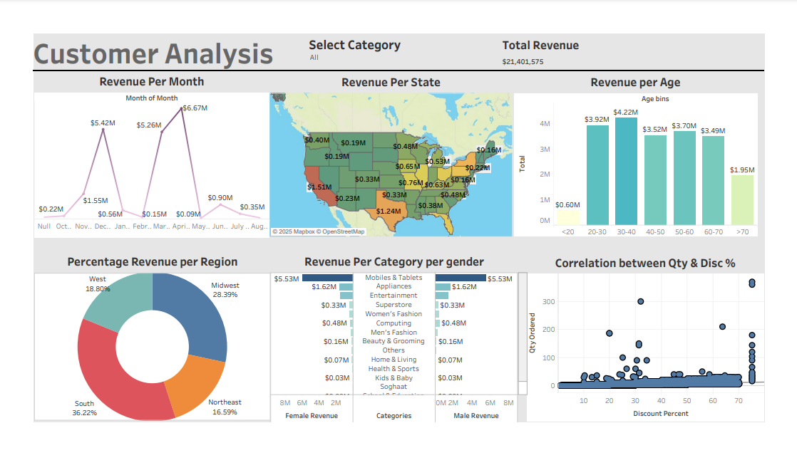

# Customer Analysis Dashboard 📊

## Overview
This Tableau **Customer Analysis Dashboard** provides a **comprehensive view** of revenue trends, customer demographics, and sales performance. The dashboard helps stakeholders make **data-driven decisions** by visualizing key metrics such as **revenue distribution, customer age groups, regional performance, and product category insights**.

## 📌 Dashboard Preview

## Dashboard Highlights 🚀
### 1. Revenue Trends
- 📈 **Revenue Per Month**: Visualizes monthly revenue fluctuations.
- 🌍 **Revenue Per State**: Geographical revenue distribution.
- 👥 **Revenue Per Age Group**: Breakdown of revenue by customer age.

### 2. Customer & Sales Insights
- 🎯 **Percentage Revenue Per Region**: Regional revenue share.
- 🛍️ **Revenue Per Category by Gender**: Compares sales by gender.
- 🔗 **Correlation Between Quantity & Discount %**: Analyzes discount impact.

## 🔮 Future Enhancements
- Adding **predictive analytics** for revenue forecasting.
- Integration with **live databases** for real-time insights.

## 🚀 How to Use
1. Open the **Tableau Workbook (.twbx)** or access the **Tableau Public Link**.
2. Use filters to explore revenue trends for different categories and regions.

## 📜 License
This project is **open-source** under the [MIT License](LICENSE).

Contributors
Brendon Matsikinya - Data Visualization & Analysis
